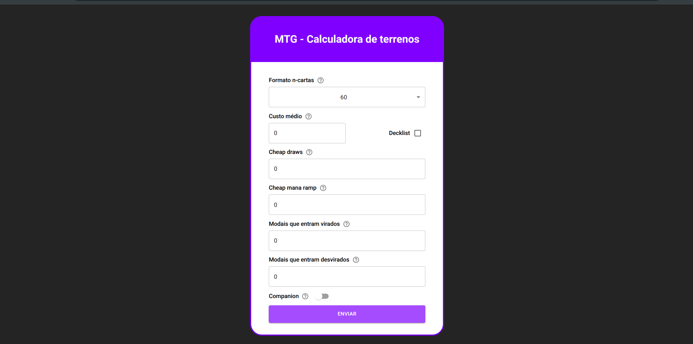

# MTG - Land calculator ☀️💧💀🔥🌳


> Magic: The Gathering (MTG) is a collectible card game where players cast spells and summon creatures to defeat their opponents. It was created by Richard Garfield and published in 1993 by Wizards of the Coast. Magic: The Gathering is available in physical and digital formats

New players, can face many "math problems" when building a new deck. Like not knowing how many lands to put on, or how many card draws, how many ramp pieces, etc.

Based on the article [How Many Lands Do You Need in Your Deck? An Updated Analysis](https://infinite.tcgplayer.com/article/How-Many-Lands-Do-You-Need-in-Your-Deck-An-Updated-Analysis/cd1c1a24-d439-4a8e-b369-b936edb0b38a/) by Frank Karsten, I coded this simple calculator using his math.

## 💻 The project



It's a simple form that calculates the number of lands based on a few data:

- **Number of cards**: Standard format (60 cards), Commander (99 cards), or even decks with companions (80 cards);
- **Average mana value of nonland cards**: Here you can manually insert the value, if you have the number or how to calculate, or you can paste the decklist (MTG Arena format) and the value will be calculated;
- **Number of cheap card draws or ramp spells**: Usually with mana cost of 1 or 2;
- **Number of modal double-faced cards**: Spells that is also lands and can enter tapped or untapped;
- If your deck has the **Companion** mechanic.

### ⚙️ Future features

- [ ] Add support to English (right now it's only in portuguese)
- [ ] A dashboard displaying the mana curve and the color pie chart
- [ ] UI improvements
- [ ] host and make the website available to the community

## 🚀 Installing and running

On the root folder:

```sh
npm or yarn install
```

Then simply

```sh
npm or yarn run dev
```

## Contributing

It's just a simple project, but it can help new developers and Magic enthusiasts. Feel free to contribute. Like I said, this is a work in progress so there's a lot to improve (including my own code 🤗).

You can also contact to report a bug or a new feature.
